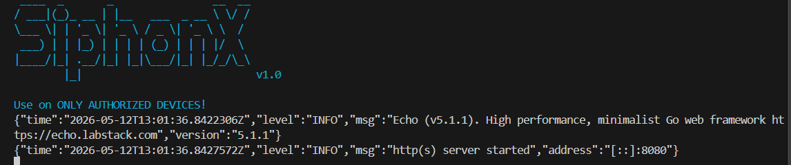
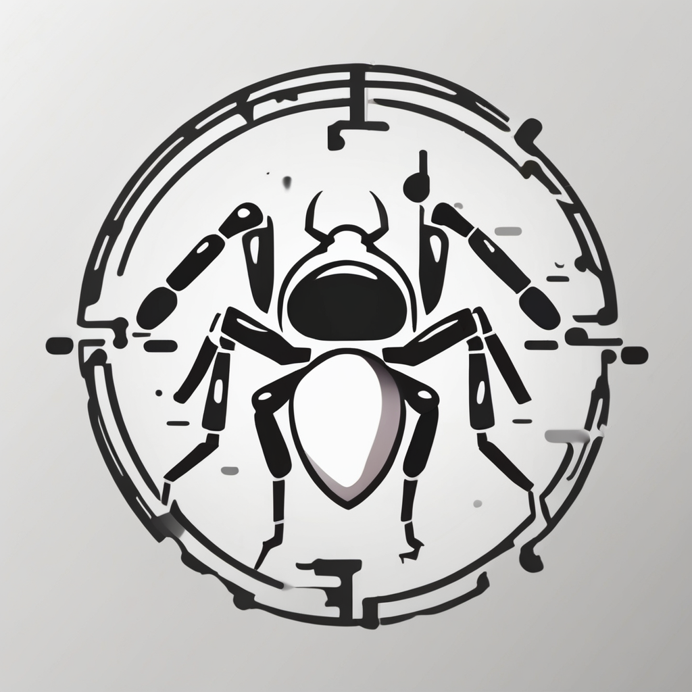

# SiphonX (Inspired by [LurkerX](https://github.com/the-hollowclan/LurkerX))

  
  
  

  
  
  
  
  

  
  
  
  

YOUR ACTIONS MUST FOLLOW CODE OF CONDUCT IN THIS URL:
https://github.com/its-ernest/SiphonX/code/of/conduct

### What led to the development of this project?
  1. Curiosity and the act of uncovering overlooked features that subtly opens endless possibilities againt device security.
  2. For efficient and sandboxed usage (CTFs, research and forensics, etc.)
  3. Make it open-source for programmers to share and expand their knowledge

### To contribute, read this page rather: <a href="CONTRIBUTING.md">CONTRIBUTING.md</a>
## Guides

**Disclaimer:**

It is crucial to emphasize that SiphonX is intended for ethical and educational purposes only. Any misuse of this project for malicious activities is strictly prohibited and could have legal consequences. The developers of SiphonX do not condone or encourage any illegal or unethical use of this software.

**Features:**

* **Location Tracking:** SiphonX can track the precise geolocation of the target device, providing detailed information about the user's movements.
* **SMS and Call Log Monitoring:** SiphonX can ibe conditioned to monitor calls and sms logs
* **Data Exfiltration:** SiphonX can be conditioned to exfiltrate sensitive data from the target device, including contacts, `photos(N/A)`, and other personal information.
* **Stealthy Operation:** SiphonX is designed to operate stealthily, or almost stealthy.
* **`Backdoor(N/A)`:** SiphonX allows advanced users to create custom commands in Shell Script for additional functionality and data collection.
    

      
      
    

**Ethical Usage:**

SiphonX can be used for various ethical research purposes, such as:

* **Understanding Spyware Behavior:** Researchers can use SiphonX to analyze the behavior of spyware applications and develop countermeasures
* **Security Training and Awareness:** Security professionals can use SiphonX to simulate real-world spyware attacks and educate users about the dangers of such threats
* **Malware Analysis and Detection:** Researchers can use SiphonX to develop and test malware detection and analysis tools

**Community and Collaboration:**

SiphonX is an open-source project, encouraging collaboration and contributions from the security research community. Developers are welcome to contribute code, report bugs, and share their findings

**Disclaimer:**

Once again, it is crucial to emphasize that SiphonX is intended for ethical and educational purposes only. Any misuse of this project for malicious activities is strictly prohibited and could have legal consequences. The developers of SiphonX do not condone or encourage any illegal or unethical use of this software.

**By using SiphonX, you agree to these terms and conditions.**
# SiphonX
